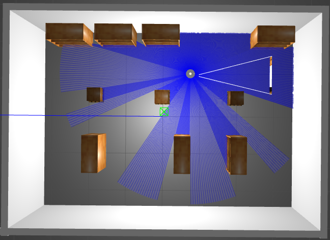

# Running Experiments on Docker

In our experiments, we run ROS nodes into three different Docker Containers: `Gazebo` on (gazebo container), `Nav2` (nav2 container), and `Rviz` (rviz container).

For the following commands, make sure you are in the project folder, have already set the necessary files enabling the Docker GUI (in the main `README`), and is logged as superuser (`root`).

## Gazebo Container

```
docker-compose -f docker/compose/compose-ros-humble-navigation-allinone.yml up gazebo
```

This will bring up the `Gazebo` world with the simulated robot such as in the image:



## Nav2 Container

```
docker-compose -f docker/compose/compose-ros-humble-navigation-allinone.yml up nav2
```

No GUI here, and a few INFO/WARNING messages are expected at the beggining, especially before bringing up Rviz. 

## Rviz Container

```
docker-compose -f docker/compose/compose-ros-humble-navigation-allinone.yml up rviz
```

You will see the `Rviz` screen with the map of the world in Gazebo. 

If you want to play around, follow [this](https://navigation.ros.org/getting_started/index.html#navigating) tutorial of how to drive the robot autonomously.

## All in one

If the above command do not work, try to run all the nodes in the same container:

```
docker-compose -f docker/compose/compose-ros-humble-navigation-allinone.yml up nav2_allinone
```